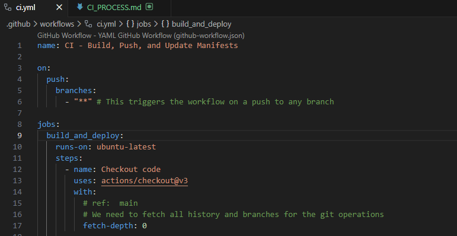
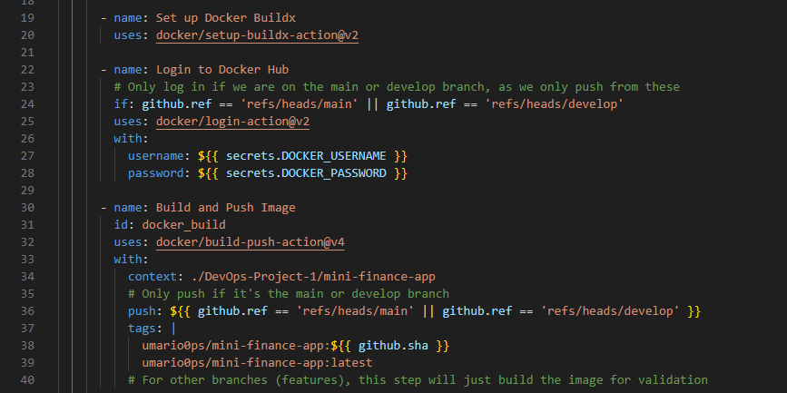
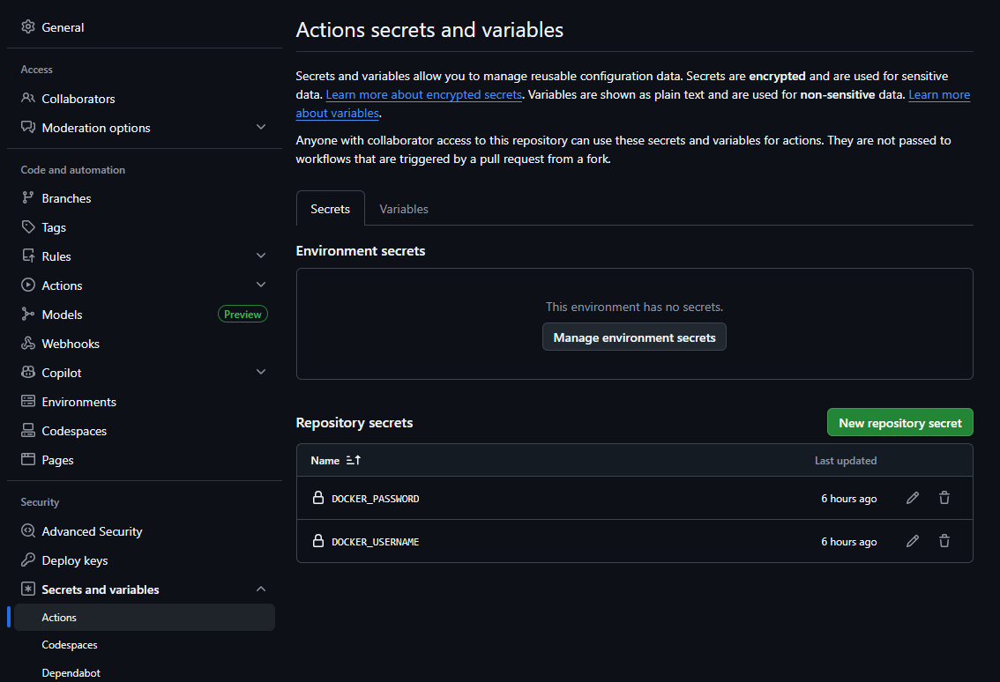
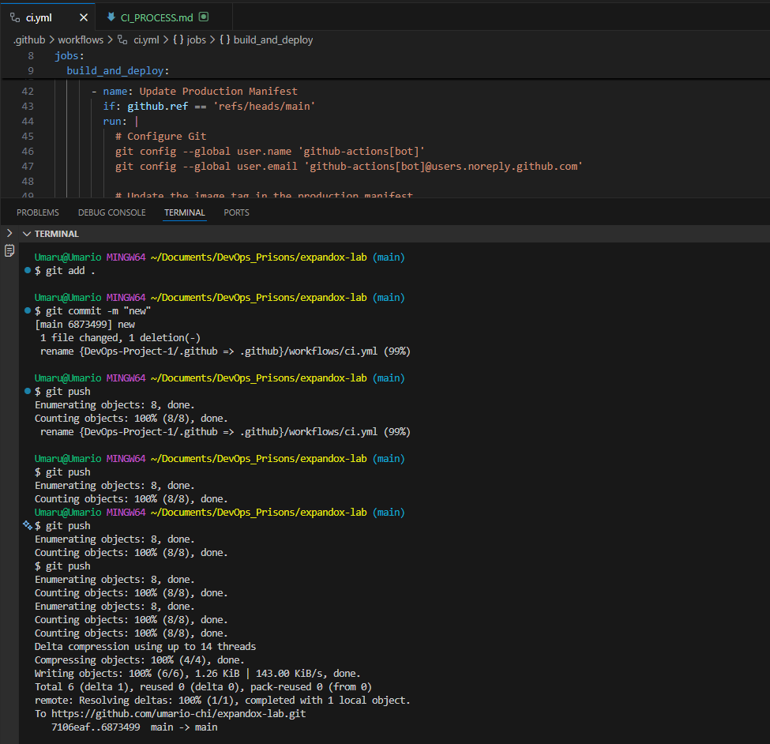
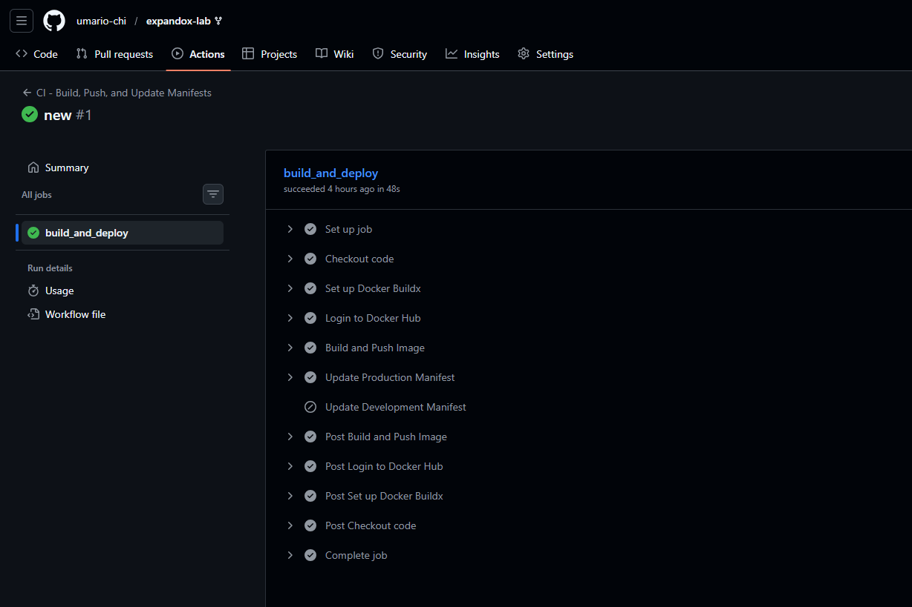
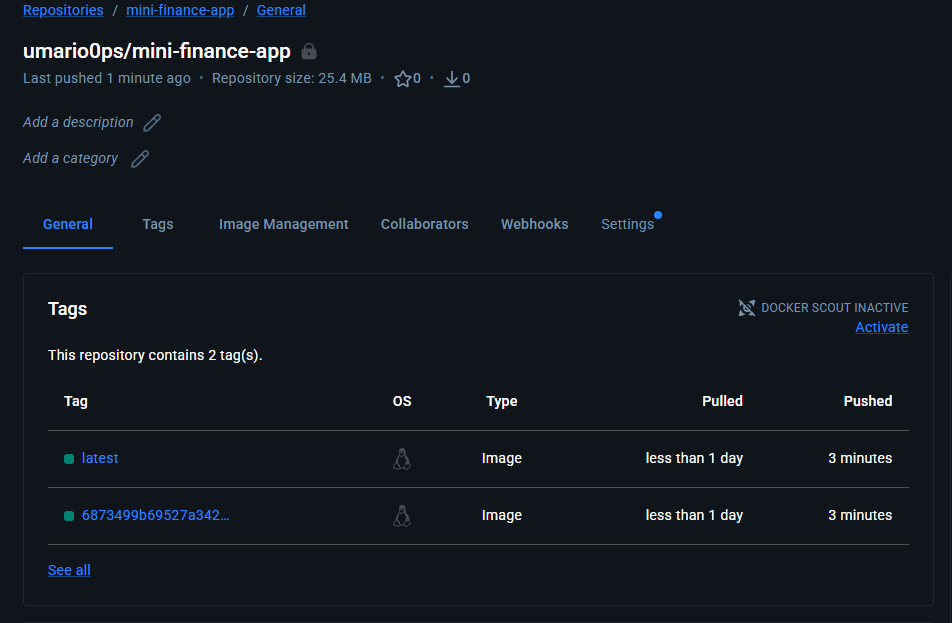

# Continuous Integration (CI) Process Documentation

This document describes the CI workflow defined in `.github/workflows/ci.yml` for this repository.

## Overview
The CI pipeline automates the following processes:
- Building the Docker image for the Mini Finance App
- Pushing the image to Docker Hub (on `main` and `develop` branches)
- Updating Kubernetes manifests with the new image tag
- Committing and pushing manifest changes back to the repository

## Trigger
- The workflow is triggered on every push to any branch.

## Steps

> **Note:** The following "Try it" commands are optional and provided for learning or manual testing. The CI/CD pipeline defined in `.github/workflows/ci.yml` already automates all these steps for you.

### 1. Checkout Code
- Uses `actions/checkout@v3` to fetch the repository code, including all branches and history.

  

  **Try it:**
  ```bash
  git clone <your-repo-url>
  cd <repo-folder>
  ```

### 2. Set up Docker Buildx
- Uses `docker/setup-buildx-action@v2` to enable advanced Docker build capabilities.

  

  **Try it:**
  ```bash
  docker buildx create --use
  docker buildx inspect --bootstrap
  ```

### 3. Login to Docker Hub
- Uses `docker/login-action@v2` to authenticate with Docker Hub.
- Only runs on `main` or `develop` branches.
- Credentials are stored in GitHub Secrets: `DOCKER_USERNAME` and `DOCKER_PASSWORD`.

  

  **Try it:**
  ```bash
  docker login -u <your-username> -p <your-password>
  ```

### 4. Build and Push Docker Image
- Uses `docker/build-push-action@v4` to build the Docker image from `DevOps-Project-1/mini-finance-app`.
- Pushes the image to Docker Hub if on `main` or `develop` branches.
- Tags:
  - `umario0ps/mini-finance-app:${{ github.sha }}`
  - `umario0ps/mini-finance-app:latest`
- On other branches, only builds for validation (no push).

  

  **Try it:**
  ```bash
  docker build -t umario0ps/mini-finance-app:latest DevOps-Project-1/mini-finance-app
  docker push umario0ps/mini-finance-app:latest
  ```

### 5. Update Kubernetes Manifests
- Updates the image tag in the appropriate manifest file based on the branch:
  - **Production Manifest** (`main` branch): `DevOps-Project-1/k8s/production/manifests.yaml`
  - **Development Manifest** (`develop` branch): `DevOps-Project-1/k8s/dev/manifests.yaml`
- Commits and pushes the change.

  **Try it:**
  ```bash
  # For production (main branch)
  sed -i "s|image:.*|image: umario0ps/mini-finance-app:latest|g" DevOps-Project-1/k8s/production/manifests.yaml
  git add DevOps-Project-1/k8s/production/manifests.yaml
  # For development (develop branch)
  sed -i "s|image:.*|image: umario0ps/mini-finance-app:latest|g" DevOps-Project-1/k8s/dev/manifests.yaml
  git add DevOps-Project-1/k8s/dev/manifests.yaml
  # Commit and push
  git commit -m "Update image tag"
  git push
  ```

## Notes
- The workflow uses the `github-actions[bot]` identity for git operations.
- If there are no changes to commit, the workflow continues without error.

## GitHub Actions Workflow Completion

After a successful run, you will see the workflow marked as completed in the GitHub Actions tab:



## Docker Hub Image Tag Update

Once the workflow completes, the new image tag will be visible on Docker Hub:



---
For more details, see the workflow file at `.github/workflows/ci.yml`.
